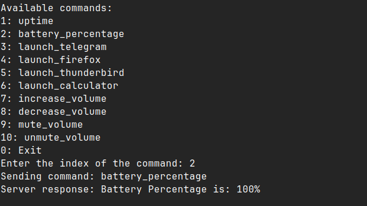
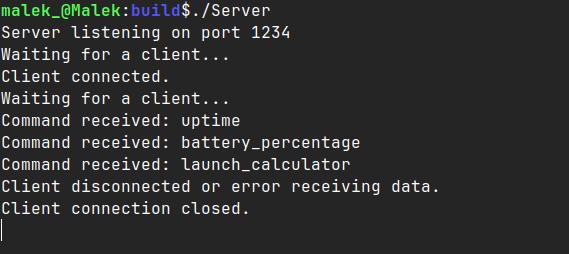
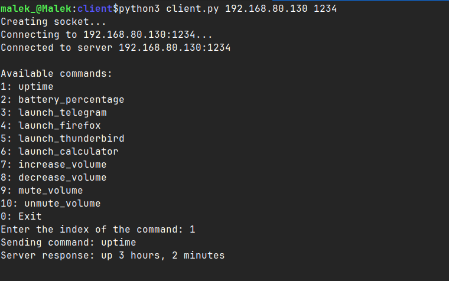

# PC Controller Project

A cross-platform PC control application where a Python client sends TCP commands to a modern C++ server. The server processes requests to execute various actions such as launching applications, adjusting volume, and retrieving system information using a command design pattern and multithreading.

## Features

- **TCP Communication:** Reliable messaging between client and server.
- **Multithreading:** Handles multiple client connections concurrently.
- **Command Pattern:** Easily extendable command execution through polymorphism.
- **Cross-Language Integration:** Combines the simplicity of Python with the performance of C++.

## Available Commands

- **1**: `uptime` - Retrieve system uptime.
- **2**: `battery_percentage` - Check battery level.
- **3**: `launch_telegram` - Launch Telegram.
- **4**: `launch_firefox` - Launch Firefox.
- **5**: `launch_thunderbird` - Launch Thunderbird.
- **6**: `launch_calculator` - Launch Calculator.
- **7**: `increase_volume` - Increase volume.
- **8**: `decrease_volume` - Decrease volume.
- **9**: `mute_volume` - Mute volume.
- **10**: `unmute_volume` - Unmute volume.

## Requirements

- **Server**: C++11 or later
  - CMake to build the project
  - Threads for handling multiple clients
- **Client**: Python 3.x
  - `socket` module (usually comes with Python by default)

## Setup

### Server

1. Clone the repository: git clone <repository_url\>
2. cd <project_directory\>
3. mkdir build/
4. cd build/
5. cmake -S ../server -B .
6. make
7. ./Server

### Client

- Ensure Python 3 is installed on your system.
-    Run the client program with the server IP and port as arguments (default values are 192.168.139.130 and 1234):

-    python3 client.py <SERVER_IP\> <SERVER_PORT\>
-    Use the client to send commands to the server by selecting a command from the available options.

## Screen Shots

### 1. Battery Percentage Command

### 2. Server Running

### 3. Uptime Command

## Code Design

- Command Design Pattern: The server uses a command design pattern, where each command is represented by a class. The commands are dynamically executed based on the client's request, making the server easily extensible with new commands.
- Polymorphism: Commands implement a common interface, allowing the server to invoke them without knowing their specific types.
- Multithreading: The server uses threads to handle multiple client connections simultaneously, ensuring responsiveness and scalability.

## Learning Goals
- Practice modern C++ features such as polymorphism, multithreading, and design patterns.
- Gain hands-on experience with network socket programming.
- Understand cross-language integration by combining Python and C++.

